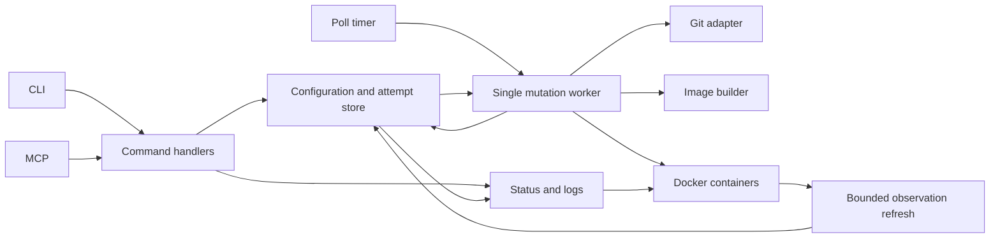

# If I started Piploy again

I would build the same small product, but give it a different data model and
update lifecycle. Keep one daemon on one Pi, TypeScript, Docker, polling, and
the private CLI and MCP controls. Make the selected commit, built image,
running container, and last failed attempt separate facts that survive a
daemon restart.

The first investment should be reliable container replacement and useful
status during a failed update. A language rewrite or a general container
platform would contribute less.

This is an exploratory proposal, not an accepted ADR. It reviews commit
`b7bcc407f638a221cbe325d548e30f1bb305aa03`. The branch deliberately changes no
runtime behavior. Compatibility and installation migration are outside this
exercise. Failure recovery remains central because keeping Applications
running is the product itself.

## What the app actually does

An Application is a registered Git repository that becomes one container.
A Poll fetches its branch, updates the local checkout, obtains an image, and
starts or replaces its container. Applications run sequentially, with errors
isolated between Applications. Docker restarts declared containers between
Polls. Cleanup removes undeclared containers and unused Application images.

Piploy also owns private-repository authentication, Dockerfile policy,
optional Buildx cache management and storage admission, named data directories,
bounded container logs, CLI and MCP commands, and automatic Bundle updates.
That is more responsibility than the opening README sentence suggests.

The review follows the implementation and its tests, rather than treating
every deliberate restriction as a missing feature. In particular,
[ADR-0006](adr/0006-an-application-is-one-container.md) explains why Ollama
runs outside Piploy, and
[ADR-0007](adr/0007-live-config-mutation-for-register.md) explains why
Register has special configuration behavior.

## Choices I would keep

| Choice | Why it still fits |
| --- | --- |
| One Pi and one daemon | There is no demonstrated requirement for coordination across hosts. |
| TypeScript and a single installed Bundle | The existing adapters and test setup are adequate. Another language would not fix the update lifecycle. |
| Docker maintains running containers | Recovery from a process exit should not wait for a Git fetch or image build. Keep the restart policy and bounded logs. |
| Polling | Works without an inbound webhook and catches missed changes. Keep periodic Polls even if a future trigger requests an earlier one. |
| One Application becomes one container | Appropriate for the current scope. Do not gradually invent container groups through special cases. |
| Application data outside disposable files | Keep human-accessible directories and the promise that Piploy never deletes Application data. |
| Localhost Application ports and private control access | Publishing an Application and administering the Pi are separate operations. |
| Small policy functions and real adapter tests | Keep pure decisions testable and use real Git and Docker for behavior those systems own. |
| Trusted repositories, constrained credentials | Preserve exact credential targeting, safe diagnostics, image policy, and dependency controls. |

## The changes that would matter

### 1. Record desired configuration, attempts, and observations separately

Today configuration lives in JSON and a mutable in-memory object.
`registerApplication` writes the file, then `runRegister` appends to the shared
array. Other edits require a restart. Docker labels and fresh Git queries
provide most of the answer to what is running.

Sources: [settings.ts](../src/settings.ts),
[daemon.ts](../src/daemon.ts), [status.ts](../src/status.ts).

I would make a small local SQLite database the daemon's authoritative record.
Keep JSON as an explicit import/export format and keep host settings in a
small bootstrap file. Register creates an Application. Later edits create
immutable configuration revisions. Neither operation starts a container;
a Poll still applies the configuration.

SQLite earns its place here because accepting configuration and recording
the work it requires belong in one transaction. Its
[atomic commit documentation](https://www.sqlite.org/atomiccommit.html)
describes the database guarantee. That guarantee does not extend to Docker.
Piploy must recover effects that completed before their database update.

Use ordinary tables and transactions. There is no need for an event-sourcing
framework, a database server, or a distributed queue.

| Record | Required information and constraints |
| --- | --- |
| Application | Stable ID, unique canonical name, desired revision, enabled flag. Renaming does not move data or change Docker ownership. |
| Configuration revision | Application ID and revision number, repository URL, explicit branch, Dockerfile, build context, target platform, runtime configuration, secret references and secret revision. Immutable; unique per Application and revision. |
| Build result | Full build-input key, exact Docker image ID, source commit, completion time. A cache hit also verifies that the image still exists. |
| Poll attempt | Stable attempt ID, Application and configuration revision, selected commit, phase, prior and candidate container IDs, timestamps, retry time, typed failure. At most one unfinished attempt per Application. |
| Observation | Application ID, inspected container ID and image ID, running configuration revision, Docker state, readiness result, observation time and last observation error. |

The daemon alone writes these records. Short database transactions never span
a Git request or Docker call. Persist the intention before an external effect,
then inspect the effect and record its result. Label containers with the
Application ID and attempt ID so startup recovery can find a container even
if the daemon died before saving its Docker ID.

Put this database in a durable control directory outside RootDirectory and
outside Application Volumes. `wipeall` preserves it as well as Application
data, then invalidates disposable-resource observations. If the database is
unreadable, stop mutations and leave Docker containers running. Recovery from
a backup must inspect Docker before resuming work. Never assume a restored
observation is current.

This reopens ADR-0001's configuration contract, ADR-0007's live array mutation,
and ADR-0005's directory model to add durable control records. JSON alone
would still be my choice for a read-only configuration file with no attempt
history. Piploy already accepts remote writes and needs recovery history.

### 2. Give image builds a complete identity

`ensureImageExists` looks up a tag derived from Application name and commit
before resolving Dockerfile and context paths. `planContainer` compares the
commit and runtime configuration hash. The build settings are absent from
both comparisons.

For example, change `DockerfilePath` from `api/Dockerfile` to
`worker/Dockerfile` at the same repository commit and restart the daemon.
The old image can be reused, and the unchanged runtime hash can keep the old
container. Changing the name to force a build should not be necessary.

Sources: `getImageVersionTagCommit`, `ensureImageExists`, and
`ensureContainerRunning` in [docker.ts](../src/docker.ts), and
`getContainerConfigHash` in [dockerPlan.ts](../src/dockerPlan.ts).

Use a canonical, versioned build-input record containing repository identity,
exact commit, Dockerfile path, explicit context path, target platform, and
the selected build policy version. Include any future build arguments or
target stage before supporting them. Hash that record for cache lookup.
Build from a clean checkout of the exact commit. Record the resulting image
ID separately, and create containers using that ID instead of a mutable tag.

A build-input key is a reuse policy, not proof of reproducibility. A Dockerfile
can still download changing packages. Keep digest rules, and require explicit
rebuild requests to bypass a saved result when desired.

Runtime identity includes the image ID, normalized ports, Volumes, environment
references, explicit secret revision, restart policy, and log configuration.
Increasing a secret revision requests recreation without hashing or storing
secret values. Resolve references immediately before container creation.

Use canonical lowercase names at admission. Current validation accepts mixed
case while image tag generation lowercases it. Stable IDs should own paths
and labels; names should be human identifiers.

This revises ADR-0001's identity and secret-refresh behavior. It preserves
ADR-0004's underlying supply-chain policy.

### 3. Treat container replacement as recoverable work

The existing implementation builds before disturbing the current container,
which is correct. But `ensureContainerRunning` then forcibly removes the old
container before creating and starting the next one. A successful Docker
start is enough for Poll success. There is no readiness gate or automatic
restore of the previous container.

Cleanup protects container-referenced images and the latest tag. Once the old
container is removed, that protection no longer guarantees a previous working
image survives. The failure is larger than a missing retry around `start()`.

Sources: `ensureContainerRunning` and `cleanupInactive` in
[docker.ts](../src/docker.ts), [orchestrator.ts](../src/orchestrator.ts).

I would accept a short interruption on one Pi and use this sequence:

1. Persist an attempt for an immutable configuration revision and selected
   commit. Fetch and build with deadlines while the current container runs.
2. Resolve secrets, validate Volumes and port declarations, and create the
   stopped candidate under an attempt-specific name. If creation fails, the
   current container stays running. Port availability must still be handled
   at start time because a preflight cannot reserve it.
3. Persist the replacement intention and prior container ID. Stop the old
   container gracefully, with a bounded forced-stop fallback. Confirm it has
   stopped before starting the candidate. Never run two writers on the same
   Application data.
4. Start the candidate and wait for the declared readiness condition with a
   deadline. Prefer an explicit health check. If none exists, report only
   that the process stayed running for a configured interval, with readiness
   recorded as unknown.
5. Persist the accepted container and image. Retain the stopped previous
   container and its image until the next successful replacement, subject to
   an explicit retention policy. Low disk space postpones new work instead
   of silently discarding required recovery resources.
6. On failure, stop and remove the candidate before considering a previous
   container restart. Record the failure and retry policy; do not let every
   timer tick repeat a failing switch without delay.

Restarting an old image is not a database rollback. If the candidate migrated
Application data before failing, the old image may no longer understand it.
Configuration must explicitly opt into automatic restore for Applications
whose data remains compatible. Default to recording a failed attempt and
requiring intervention after a candidate has started. Before the candidate
ever starts, restoring the retained container is safe from candidate writes.
Application backups and migration recovery remain separate responsibilities.

This deliberately reopens ADR-0006's exclusion of health gating and extends
ADR-0009. It still permits only one running container per Application, though
stopped candidates and previous containers can coexist.

### 4. Let observation continue while work runs

The current daemon returns `poll-in-progress` for status and logs during a
Poll. Otherwise status fetches Git before answering. That makes diagnostics
least useful during a long build, and makes reading status depend on remote
availability. This is intentional and tested, not an accidental queue bug.

Sources: `enqueueClient` and `createDaemonDeps` in
[daemon.ts](../src/daemon.ts), `getCommitStatus` in [git.ts](../src/git.ts),
and [daemon tests](../test/unit/daemon.test.ts).

Keep one mutation worker and one build at a time on the Pi. Serve status from
saved observations independently. Refresh Docker observations with bounded
calls and publish their timestamps; fetch remote commits during Polls.
Logs read the requested container directly with the existing output bounds.
An unavailable Docker daemon yields an explicit stale observation, not an
invented stopped state.

Expose desired revision, selected commit, active image, attempt phase,
last failure, next retry, and observation age. Replace the single
`isRunningLatestVersion` claim with those facts. A matching Git commit alone
does not establish matching runtime configuration or readiness.

A manual Poll returns an attempt or batch ID promptly. Repeated requests for
the same pending work join that work. A disconnected client can query its
result later. Periodic requests coalesce, and retries rotate among
Applications so one failing repository cannot monopolize the worker.
Stop signals cancellation immediately rather than waiting behind a build.
Every remote operation needs a deadline and a defined cancellation outcome.

The daemon should be the only mutation process. The current offline Poll
fallback checks whether the daemon is listening, but that check cannot itself
exclude two standalone invocations or a simultaneous daemon startup. Use an
exclusive process lock acquired before any mutation. If one-shot execution
is retained, it must acquire that same lock and use the same worker.

This reopens ADR-0008's rule that all reads enter the mutation queue, while
preserving its shared command implementation and private access intent.

## Proposed module responsibilities

Command handlers validate and persist intent. The worker advances attempts
and owns retries and recovery. The builder owns image construction and cache
admission. Docker container operations own inspection, start, stop, and
removal. The store owns transactions and retention references. Transports
format requests and responses; they do not decide update behavior.

Keep these as modules in one process. Extract code where responsibilities
actually differ, especially building versus replacing containers. Do not add
an interface for every file or introduce a message broker.

## Other choices I would reconsider

**Use one build backend.** Starting today, I would select Buildx and delete the
legacy build path after validating the required Pi setup. Current
[buildx.ts](../src/buildx.ts) already has storage admission and cache policy.
Two backends create two cancellation and failure behaviors. Keep disk
admission, bounded logs, protected images, and targeted cleanup regardless of
backend. Validate ARM64 cold and warm builds before treating this as settled.

**Keep building on the Pi initially.** It preserves the current Git-to-running
Application workflow without requiring every repository to publish ARM64
images. If measured build duration or storage pressure dominates operation,
add a digest-pinned image source and move builds into repository CI. Do not
require a registry pipeline before those measurements justify it.

**Make Bundle updates explicit initially.** Automatic replacement of the
controller adds another recovery problem. `downloadAndSwap` performs two
renames, leaving a failure window after the installed Bundle moves to `.prev`
and before the new file takes its place. It also has no startup acceptance
check. Use versioned Bundle files and an atomic active-file selection, with
the previous selection retained. An external launcher must validate startup
and restore the previous selection if automatic updates return. Disable
automatic updates until that recovery is tested. This reopens
[ADR-0003](adr/0003-self-update-placement.md).

**Retain private MCP, verify its binding explicitly.**
[ADR-0008](adr/0008-mcp-server-tailscale-only.md) already records that an
address-range heuristic can select a non-Tailscale interface. Require an
explicit verified Tailscale address or authoritative local discovery and fail
closed for MCP, while preserving the local socket. Move the hardcoded GitHub
owner in the repository-access command into host policy. Keep credential
targeting strict. This is configuration cleanup, not a reason to build a
general identity service.

**Do not adopt Compose for the current contract.** Compose already describes
services, networks, Volumes, and builds in its
[application model](https://docs.docker.com/compose/intro/compose-application-model/).
If container groups become a requirement, use Compose rather than recreating
its dependency model. But adopting it today would change Application ownership,
cleanup, Volume rules, and policy validation without solving Piploy's attempt
history or readiness recovery. The fact that Compose requires a CLI plugin
is no longer a persuasive objection by itself, since Buildx now does too.
Reopen ADR-0006 when a concrete second workload requires coordinated containers.

## Work order and evidence required

These are independently reviewable steps toward the proposed design, not
commitments to merge this branch. They assume no compatibility bridge.

| Order | Deliverable | Acceptance evidence |
| --- | --- | --- |
| 1 | Full build identity and exact image references | At the same commit, changing Dockerfile or context obtains the correct new image; changing only runtime settings reuses the image. |
| 2 | Durable revisions and attempts, exclusive mutation ownership | Kill the daemon after accepting intent; restart preserves the request. Competing mutation processes cannot both acquire ownership. |
| 3 | Retained-container replacement and recovery | Inject failure and process death at every external effect in the table below. Verify actual Docker containers, ports, and image retention. |
| 4 | Independent observations and bounded work | A blocked build permits status and logs; stale Docker observations remain labeled stale. Git failures do not delay every Application indefinitely. |
| 5 | One builder and explicit Bundle updates | ARM64 build/cache/storage tests pass. Failed Bundle activation leaves a usable previous Bundle. |

| Failure point | Required result after restart |
| --- | --- |
| Intent saved, build not started | Resume the same attempt from its pinned revision and commit. |
| Build finished, image ID not saved | Find the labeled result and verify it, or rebuild without touching the active container. |
| Candidate created, ID not saved | Find it by attempt labels. Do not create a duplicate candidate. |
| Old container stopped, candidate not started | Inspect both containers, then resume or restore the old container. Never start both. |
| Candidate started, acceptance not saved | Inspect and re-run readiness checks; do not blindly start the old container. |
| Candidate fails after writing data | Apply the declared restore policy. Without opt-in, retain evidence and require intervention. |
| Acceptance saved, cleanup interrupted | Keep the accepted and required previous images. Retry only eligible cleanup. |
| Docker unavailable | Preserve attempt and observation history; report unavailable and retry with delay. |
| Configuration changes during a build | Before stopping the old container, reject an obsolete candidate and select the new revision. If replacement already began, finish or recover it before applying the new revision. |

Additional tests should cover disk exhaustion before replacement, a host port
claimed between preflight and start, secret rotation at the same commit,
process cancellation during Git and build work, and Application removal with
Volumes retained. Start with real Docker failure tests for replacement;
mock-only tests cannot establish name, port, or restart-policy behavior.

Measure on the Pi: status latency during a cold build, per-Application update
duration, interruption during replacement, peak disk usage, and recovery time
after process death. I would aim for local status below one second during a
build, but this is an acceptance target, not a measured result.

## Scope and confidence

High confidence: build identity is incomplete, replacement loses the prior
container before success, and read commands are intentionally unavailable
during Polls. These follow directly from the inspected source and existing
tests. No production incident or performance measurement is claimed.

Medium confidence: SQLite is the best persistence choice and Buildx should be
the sole builder. The proposed failure cases justify durable transactions;
the installation and resource costs still need a Pi experiment. Registry-only
builds and Compose remain conditional product decisions.

This draft supplies a design rather than a partial runtime rewrite. Adding a
new store without startup recovery, or retaining containers without fixing
cleanup, would demonstrate only part of the behavior that matters. The next
implementation should begin with build identity, then prove recovery with
real process interruptions before expanding the command set.
